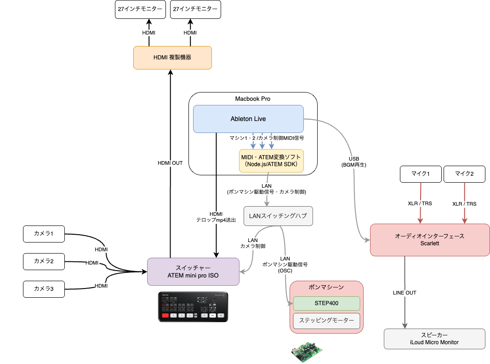

# ponMachineSTEP

卒業式の筒（卒業証書を入れる筒）を自動で開閉する装置の制御アプリケーション

Electron + React + TypeScript で構築された、MIDI信号による自動化システムです。

## 機器構成



## 主な機能

### 1. 卒業式の筒の自動開閉制御

- MIDI信号で筒の開閉を制御
- Port 1/2: 複数の筒を個別制御
- ノートON/OFFで開閉を切り替え

### 2. BlackMagic ATEMスイッチャー制御

- Port 3: ATEMスイッチャー制御用MIDI入力
- MIDI信号でカメラ切り替えを制御
- ノートC/D/E/F → カメラ1/2/3/4に対応
- Auto Transition（フェード切り替え）対応

### 3. ステッピングモーター制御

- STEP400コントローラー（4軸）をOSCで制御
- 筒の開閉機構を駆動
- 位置制御で開閉角度を調整
- ホーミングで初期位置を設定

## 技術仕様

- **フロントエンド**: React 19 + TypeScript
- **デスクトップ**: Electron 38
- **通信**:
  - OSC（UDP） - STEP400コントローラー
  - atem-connection - ATEMスイッチャー
- **MIDI**: Web MIDI API
- **ビルド**: electron-vite + electron-builder

## ネットワーク設定

### STEP400コントローラー（OSC通信）

- **IPアドレス**: `10.0.0.101`
- **送信ポート**: `50000` (STEP400へのコマンド送信)
- **受信ポート**: `50101` (STEP400からの応答受信、deviceID=1の場合)
- **ポート計算**: 受信ポート = `50100 + deviceID`

### ATEMスイッチャー

- **IPアドレス**: `10.0.0.14`
- **プロトコル**: atem-connection (TCP)

## 開発環境

### セットアップ

```bash
# 依存関係のインストール
$ npm install

# 開発サーバー起動
$ npm run dev

# ビルド
$ npm run build

# プラットフォーム別ビルド
$ npm run build:win    # Windows
$ npm run build:mac    # macOS
$ npm run build:linux  # Linux
```
